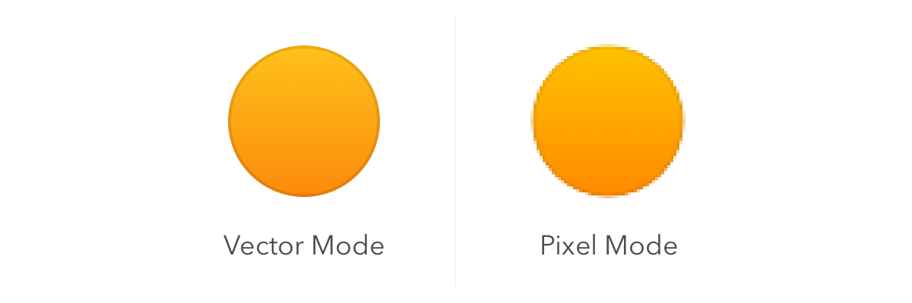

# Canvas
Sketch’s Canvas is infinite in size; you can scroll as far as you want in any direction, so you have complete freedom on how you set up your drawing area.
> Sketch 的画布是无穷大的。你可以在任意方向滚动，你有完全的自由来决定怎么建立你的绘画区域。

If you’d like to define a fixed frame inside the infinite canvas, simply insert one or more Artboards. For example when designing mobile interfaces, many designers create an Artboard for each screen in the app and lay them out in order of appearance.
> 如果你想在画布上定义一个固定的框架，只要插入一个或多个画板。例如，当设计移动app界面时，很多设计师为app的每一个屏幕创建一个画板，并且把它们按顺序展示。

You can view the Canvas both in a resolution-independent view where you have infinite precision, or you can turn on pixel preview and you will know exactly how every pixel will look when it’s being exported to a bitmap format (such as JPG or PNG). You can learn more about these modes in [Pixel Zoom](pixel-zoom.md).
> 你能够用你拥有的任意精度的分辨率无关的屏幕来查看画布。或者你也可以开启像素预览，你将精确地看到导出的位图格式（像JPG或PNG）中的每一个像素。你能够学到更多这些模式在 [像素放大](pixel-zoom.md)

Note: Some effects such as blur will force parts of the Canvas to be displayed in pixel preview mode, as a blur is inherently a pixel-based effect.
> 注释：一些特效，像模糊，在像素预览模式下，会强制显示部分画布。因为，模糊天生就有一个基于像素的特效。

