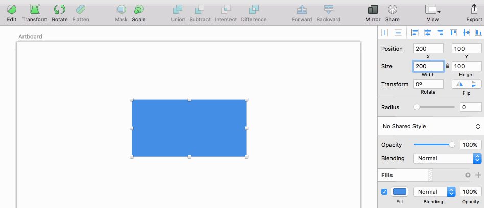
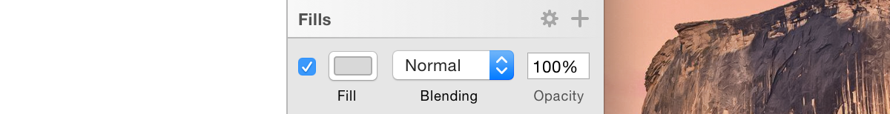
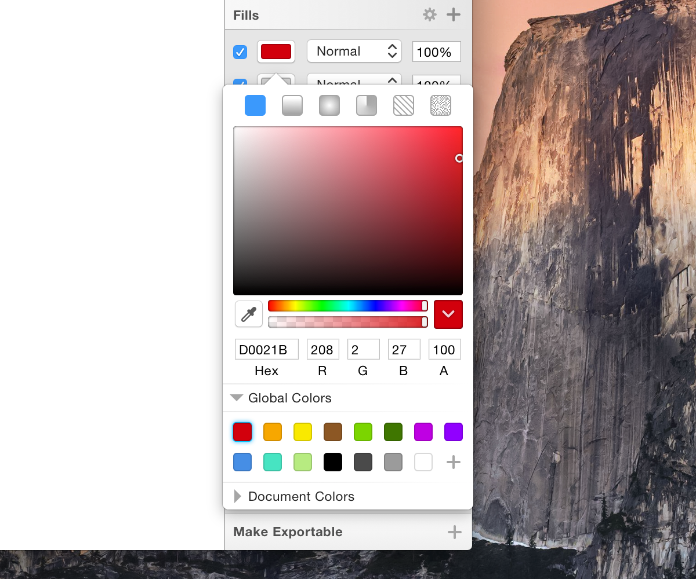
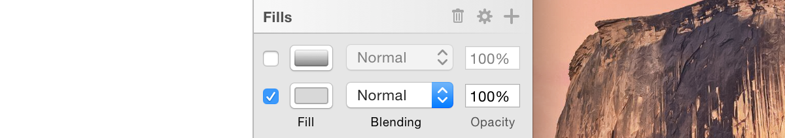

# Inspector
> 检查器

The Inspector on the right lets you adjust the settings for the current layer, or the options for the current tool. When you have a layer selected you will see that the Inspector is divided into sections.
> 右侧的检查器让你调整当前图层的设置，或者当前工具的选项。当你选中了一个图层，你将看到检查器被分成多个部分。

## Alignment Options
> 对齐选项

In a bar at the very top of the Inspector are buttons for aligning and distributing layers. These buttons will become active when you have more than one layer selected. More information about this feature can be found under [Moving Layers](moving-layers.md).
> 检查器顶部的横条是用于对齐和分布图层的按钮。这些按钮在你选择多个图层后变成激活状态。关于这个功能的更多信息可以在[移动图层](moving-layers.md)页找到。

## Layer Properties
> 图层属性

The layer properties are visible in the top part of the Inspector; the position, size, opacity, blending, and (depending on the layer type) a few special options, like corner radius for a rectangle or the number of points for a polygon shape.
> 图层属性位于检查器的顶部部分：位置、大小、 不透明度、混合、和一些其它选项（依赖于图层类型），像长方形的圆角半径或者多边形的点数。

## Text Fields
> 文本域

The text fields in the Inspector aren’t ordinary text fields. If you hover your pointer over them you will see little up and down arrows appear on the right-hand size of the text field. You can click those to quickly increment or decrement the value. If you hold the Shift key, Sketch will instead increment or decrement the value by 10 times as much. Holding down the Option key will increase/decrease it by a tenth of that size.
> 检查器里的文本域不是普通的文本域。如果你把鼠标移到它们上面的时候，你将在文本域的右手边看到小的上下箭头。你可以点击它们去增加或者减小值。如果你按住 Shift 键，Sketch 将按照10倍的值进行增减。如果你按住 Option 键，将按照第十个值进行增减。

**Up and Down**
> 上下

Once you are editing the text fields directly, the up and down arrows will have disappeared, but their functionality is still available. You can use the up an down arrow keys in combination with the Shift key to change the value by 10.
> 一旦你直接编辑文本域，上下箭头将消失，但是它们的功能仍然有效。你可以使用上下箭头结合 Shift 键来实现10倍的值增减。

**Math**
>  数学

Another great feature in our text fields is that you can perform math operations in all numerical inputs of the Inspector. You can add, subtract, divide, multiply, and in some cases, use percentage to adjust your objects, as shown below. For example, you can select a layer and use +, –, *, or / in any of the numerical fields. In the radius input field for rectangles, you can specify a different value for each corner by using / (eg. 40.0/40/0).
> 文本域的另一个重大的功能是，你能够在检查器的所有数值输入框进行数学运算。一些情况下，你可以进行加、减、乘、除运算，另一些情况下，你可以使用百分比来调整对象，就像下图演示的那一。在矩形的半径输入域，你能通过使用 / 为每个角指定不同的值。(例如：40/0/40/0)

You can use specify a percentage in the height or width values of an object if it is contained inside a group or Artboard. Sketch will calculate the value and resize the layer. (eg, giving a layer’s width value “10%” when its in a 960 px-wide Artboard will change its width to 96 px).
> 如果你一个对象在一个组或者画板里，你可以使用百分比来指定对象的宽高。Sketch 将计算这个值然后调整图层。（例如：给定一个图层的宽度值为“10%”，当它在一个960像素宽的画板上时，宽度将调整到96像素。）

**Scrubbing Values**
> 擦洗值

For quickly adjusting text field values you can click-and-drag on the label under any text field to quickly increase or decrease its value. If you’re not sure about the exact value you want but just want to see its effect on the Canvas, this is great way for quick experimentation.
> 为了快速调整文本域的值，

## Layer Styles
> 图层样式

The Fills, Borders, Shadows, and Blur style attributes that can be applied to layers each have their own sections.
> 填充、边框、阴影和模糊样式属性可以被应用到图层。每一个样式都有它们自己的设置段落。

To add a new style attribute to a layer, just click the add button in the desired section title:
> 想要为图层添加新的样式属性，只要在你想要的段落标题上点击加号按钮。

When adding a new Fill, Border, or Shadow, you’ll get a popover where you can select its color:
> 当添加一个新的填充、边框或者阴影时，选择颜色，会填充颜色窗口。

You can hide each attribute by deselecting the visibility checkbox on its left. When one or more Fills, Borders or Shadows are deselected, you can remove them by clicking on the delete button that appears on the section title:
> 你可以取消选中左边的复选框来隐藏任一属性。当一个或多个填充、边框或阴影被取消选中，你可以点击段落标题上出现的删除按钮来删除它们。

You can apply a Blur much the same way, by selecting the visibility checkbox in the section title. You can then choose the type of blur being applied to your layer from the pop-up menu, and adjust its blur radius.

## Exporting
> 导出

In the bottom-left of the Inspector, you will find the Make Exportable option. From here, you can make any layer or group ready for export by pressing the add button. You learn more about the different exporting options here.
> 在检查器的左下角，你将找到导出图层选项。从这儿，你可以通过点击加号让任意图层或者组导出。

