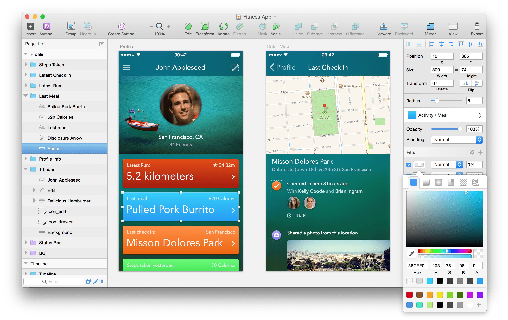

# The Interface

Sketch’s interface is minimal by design.
> Sketch 的界面是最小化的设计。

The toolbar along the top contains all the important tools and actions. The Inspector on the right lets you adjust the properties of the selected layer(s). The Layer List is the the pane on your left, and lists all the layers and Artboards in your document. Last but not least, the Canvas in the middle is where you will see your designs.
> 紧挨着顶部的工具栏包含所有重要的工作和动作。右侧的检查器让你可以调整选中图层的属性。左侧的窗格是图层列表，它列出了文档中的所有图层和画板。最后并且最重要的是中间的你将在上面进行设计的画布。

There are no floating panels. Instead, the Inspector will adapt to show you the tools you need at every moment, and hide everything else. That way you always have a completely unobscured view of your Canvas.
> 没有浮动的窗格。取而代之的是，检查器将采用每次只显示你需要的工具，隐藏其他的。这样，你总是有一个完全清晰的画布窗口。

### In this section…

- [画布](Canvas.md)
- [检查器](Inspector.md)
- [图层列表](Layer-List.md)
- [工具栏](Toolbar.md)

